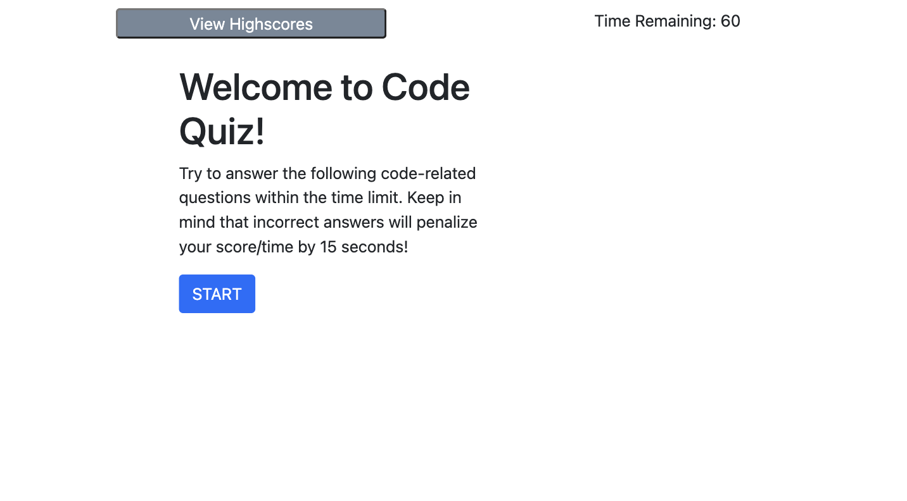
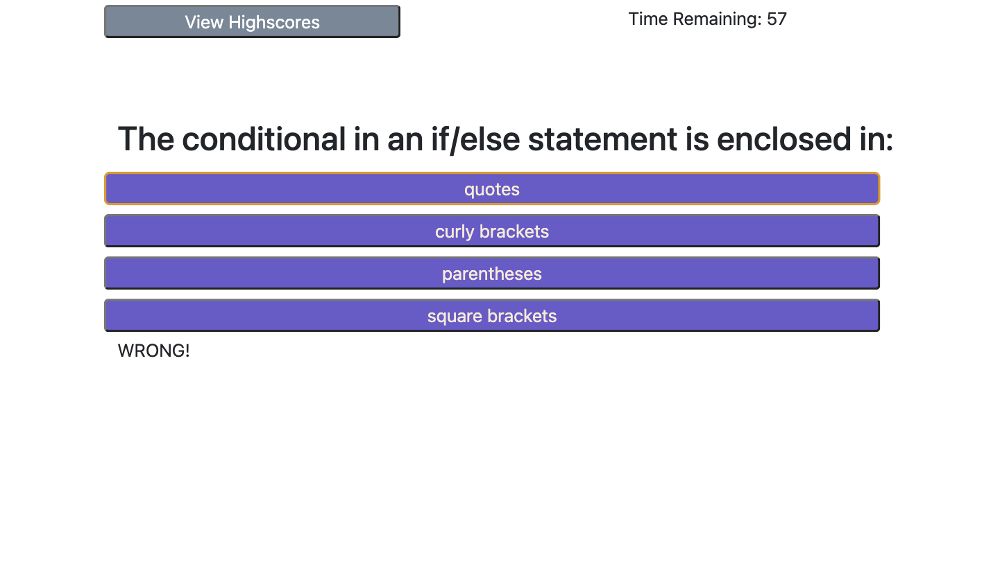
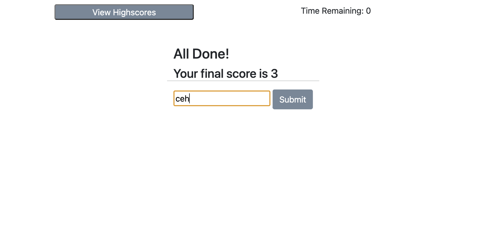
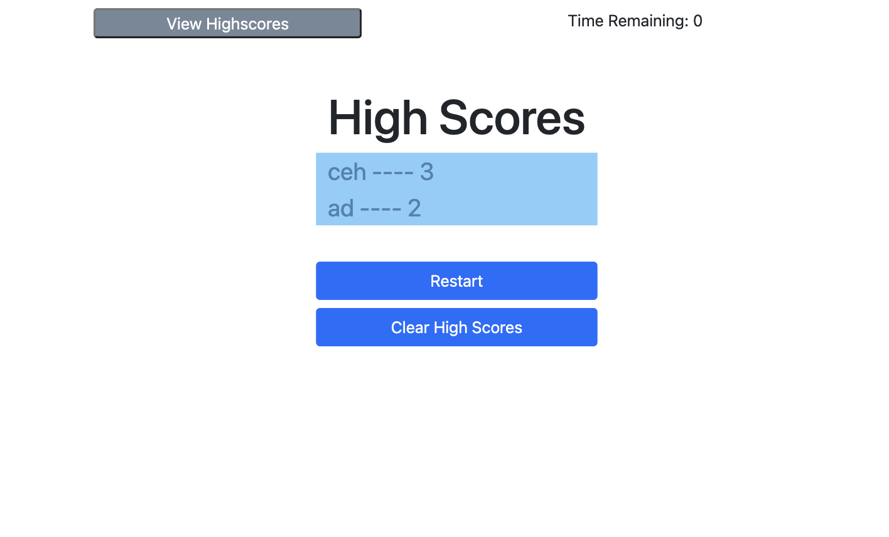

# wk4 - Code Quiz

# Description
The purpose of this project is to create a timed quiz and store the user's initials and high score.

Javascript enables the code to dynamically display different elements based on the user's selection. It begins with the initial screen, and when the user presses "Start," the page displays one question at a time until the user completes the questions, the time runs out, or the user decides to view the high score page instead.

Every wrong answer penalizes the user by 15 seconds. The page will display a feedback message based on the user's answer selection for 1.5 seconds before disappearing.

The user can view a list of scores corresponding to users' initials. These values are stored in local storage. From the high score screen, the user can clear the high scores from the page and local storage when the "Clear Score" button is pressed and/or restart the game. When "Restart" is pressed, the user is taken back to the initial screen.

> **Note**: While this code does operate according to the acceptance criteria, it is, currently, by no means elegant. For example, the scores list is not currently sorted from highest to lowest; however, that ability was not defined in the acceptance criteria. The user's initials and scores could be better organized in an object and called to and from storage using .map, but the author struggled immensely until the author acquiesced to frustration and gave up under the given time crunch due to anxiety-induced procrastination.

When the website is opened (or when source code is opened in default browser), the following screens should appear as shown in the images below based on where the user is in the quiz.

## Installation

N/A

## Usage

Open the webpage using the [live URL link](https://chloeeh.github.io/hanks-code-quiz/) and use Chrome Developer Tools to inspect the source code. The code is commented and includes accessibility tags compared to the original code that used generic division tags.

## Credits

Resources used:
1) Bootcamp Pre-work Modules
2) Bootcamp 04-Javascript > 01-Activities
3) Bootcamp 05-Javascript > 01-Activities 
4) [Bootstrap Uses](https://getbootstrap.com/)
5) Various stackoverflow forums (i.e. working with localStorage)

## License

Please refer to the LICENSE in the repository.